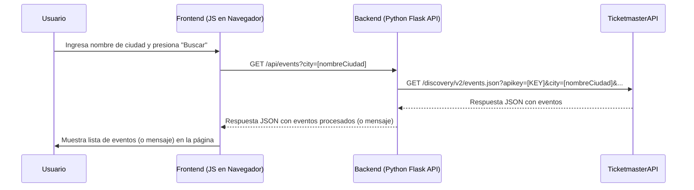

# Globoticket: Documentación del Desarrollo de la Aplicación de Búsqueda de Eventos

**Autor:** Julián Andrés Mosquera (con asistencia de IA)
**Fecha de Creación:** [Junio de 2025]
**Versión:** 1.0

## Tabla de Contenidos

1.  [Introducción y Objetivo del Proyecto](#1-introducción-y-objetivo-del-proyecto)
2.  [Requisitos Fundamentales de Interacción (Humano-IA)](#2-requisitos-fundamentales-de-interacción-humano-ia)
3.  [Arquitectura General Propuesta](#3-arquitectura-general-propuesta)
    *   [3.1. Frontend (Cliente)](#31-frontend-cliente)
    *   [3.2. Backend (Servidor)](#32-backend-servidor)
    *   [3.3. API Externa (Ticketmaster)](#33-api-externa-ticketmaster)
    *   [3.4. Diagrama de Flujo de Datos](#34-diagrama-de-flujo-de-datos)
4.  [Fases de Desarrollo Detalladas](#4-fases-de-desarrollo-detalladas)
    *   [4.1. Fase 1: Configuración del Entorno y Herramientas](#41-fase-1-configuración-del-entorno-y-herramientas)
        *   [4.1.1. Configuración del Backend (Python)](#411-configuración-del-backend-python)
        *   [4.1.2. Configuración del Frontend (HTML, CSS, JavaScript)](#412-configuración-del-frontend-html-css-javascript)
        *   [4.1.3. Configuración y Acceso a la API de Ticketmaster](#413-configuración-y-acceso-a-la-api-de-ticketmaster)
        *   [4.1.4. Resumen de Herramientas y Tecnologías Clave](#414-resumen-de-herramientas-y-tecnologías-clave)
    *   [4.2. Fase 2: Desarrollo del Backend (Python)](#42-fase-2-desarrollo-del-backend-python)
        *   [4.2.1. Creación del Servidor Flask Básico y Endpoint API](#421-creación-del-servidor-flask-básico-y-endpoint-api)
        *   [4.2.2. Manejo de la API Key de Ticketmaster](#422-manejo-de-la-api-key-de-ticketmaster)
        *   [4.2.3. Interacción con la API de Ticketmaster](#423-interacción-con-la-api-de-ticketmaster)
        *   [4.2.4. Procesamiento de Datos y Formato de Respuesta](#424-procesamiento-de-datos-y-formato-de-respuesta)
        *   [4.2.5. Manejo de Errores del Backend](#425-manejo-de-errores-del-backend)
        *   [4.2.6. Desafíos y Soluciones en la Fase 2](#426-desafíos-y-soluciones-en-la-fase-2)
            *   [Desafío 2.6.a: Carga de la Variable de Entorno `TICKETMASTER_API_KEY`](#desafío-26a-carga-de-la-variable-de-entorno-ticketmaster_api_key)
        *   [4.2.7. Código Final de `app.py` (Backend)](#427-código-final-de-apppy-backend)
    *   [4.3. Fase 3: Desarrollo del Frontend (JavaScript)](#43-fase-3-desarrollo-del-frontend-javascript)
        *   [4.3.1. Estructura HTML (`index.html`)](#431-estructura-html-indexhtml)
        *   [4.3.2. Estilos CSS (`styles.css`)](#432-estilos-css-stylescss)
        *   [4.3.3. Lógica JavaScript (`script.js`)](#433-lógica-javascript-scriptjs)
        *   [4.3.4. Integración Frontend-Backend](#434-integración-frontend-backend)
        *   [4.3.5. Desafíos y Soluciones en la Fase 3](#435-desafíos-y-soluciones-en-la-fase-3)
            *   [Desafío 3.5.a: Comprensión del Flujo de Servicio de Archivos y API](#desafío-35a-comprensión-del-flujo-de-servicio-de-archivos-y-api)
        *   [4.3.6. Código Final de Archivos Frontend](#436-código-final-de-archivos-frontend)
5.  [Estructura Final del Proyecto](#5-estructura-final-del-proyecto)
6.  [Instrucciones de Configuración y Ejecución para GitHub](#6-instrucciones-de-configuración-y-ejecución-para-github)
    *   [6.1. Prerrequisitos](#61-prerrequisitos)
    *   [6.2. Clonar el Repositorio](#62-clonar-el-repositorio)
    *   [6.3. Crear y Activar un Entorno Virtual](#63-crear-y-activar-un-entorno-virtual)
    *   [6.4. Instalar Dependencias](#64-instalar-dependencias)
    *   [6.5. Configurar la API Key de Ticketmaster](#65-configurar-la-api-key-de-ticketmaster)
    *   [6.6. Ejecutar la Aplicación](#66-ejecutar-la-aplicación)
    *   [6.7. Acceder a la Aplicación](#67-acceder-a-la-aplicación)
7.  [Consideraciones Adicionales y Futuras Mejoras](#7-consideraciones-adicionales-y-futuras-mejoras)
8.  [Conclusión](#8-conclusión)

---

## 1. Introducción y Objetivo del Proyecto

El proyecto Globoticket tiene como objetivo desarrollar una aplicación web simple que permita a los usuarios buscar eventos culturales y de entretenimiento en una ciudad específica. La aplicación interactúa con la API de Ticketmaster para recuperar y mostrar la información de los eventos.

La pila tecnológica seleccionada incluye:
*   **Backend:** Python con el microframework Flask.
*   **Frontend:** HTML, CSS y JavaScript (Vanilla JS).
*   **Fuente de Datos:** API de Ticketmaster Discovery.

Esta documentación detalla el proceso de desarrollo, desde la solicitud inicial y la planificación hasta la implementación de cada componente, incluyendo los desafíos encontrados y sus respectivas soluciones.

## 2. Requisitos Fundamentales de Interacción (Humano-IA)

La colaboración para este proyecto se rigió por seis directrices fundamentales establecidas por Julián Andrés Mosquera para asegurar la máxima eficacia y rigor:

1.  **Idioma y Tono:** Comunicación exclusivamente en español latino formal, profesional, claro, preciso y objetivo.
2.  **Estructura Excepcional:** Respuestas meticulosamente estructuradas con encabezados, listas, párrafos definidos, etc.
3.  **Profundidad y Detalle:** Respuestas exhaustivas y detalladas.
4.  **Claridad Conceptual y Ejemplificación Rigurosa:** Definición de términos clave y uso de ejemplos concretos y relevantes.
5.  **Consistencia y Calidad Suprema:** Mantenimiento de altos estándares en todas las respuestas.
6.  **Autocorrección Implícita:** Revisión interna crítica antes de entregar cada respuesta.

La IA confirmó la comprensión y adhesión a estas directrices.

## 3. Arquitectura General Propuesta

Se optó por una arquitectura cliente-servidor clásica:

### 3.1. Frontend (Cliente)
Desarrollado con HTML, CSS y JavaScript (Vanilla JS). Se ejecuta en el navegador del usuario y es responsable de:
*   Presentar la interfaz de usuario (campo de entrada para la ciudad, botón de búsqueda, área para mostrar resultados).
*   Capturar la entrada del usuario.
*   Realizar solicitudes HTTP asíncronas (AJAX) al backend.
*   Recibir los datos de eventos del backend y renderizarlos dinámicamente en la página.

### 3.2. Backend (Servidor)
Desarrollado con Python y el microframework Flask. Es responsable de:
*   Exponer una API RESTful simple (un endpoint `/api/events`).
*   Recibir solicitudes del frontend con el nombre de la ciudad.
*   Construir y ejecutar solicitudes a la API de Ticketmaster, incluyendo la autenticación con API Key.
*   Manejar la respuesta de la API de Ticketmaster (parsing, formateo de datos).
*   Enviar los datos de eventos formateados (en JSON) de vuelta al frontend.
*   Servir la página HTML principal y los archivos estáticos (CSS, JS).

### 3.3. API Externa (Ticketmaster)
La [API Discovery de Ticketmaster](https://developer.ticketmaster.com/products-and-docs/apis/discovery-api/v2/) actúa como la fuente de datos para la información de los eventos. Se requiere una API Key para su uso.

### 3.4. Diagrama de Flujo de Datos (Conceptual)



## 4. Fases de Desarrollo Detalladas

### 4.1. Fase 1: Configuración del Entorno y Herramientas

Esta fase se centró en preparar el entorno de desarrollo y obtener las credenciales necesarias.

#### 4.1.1. Configuración del Backend (Python)
*   **IDE:** Se utilizó Visual Studio Code (VS Code).
*   **Entorno Virtual:** Se creó un entorno virtual (denominado `venv` o `ticketmasterEnv` por el usuario) para aislar las dependencias del proyecto.
    *   Comando: `python -m venv nombre_entorno`
    *   Activación (Windows PowerShell): `.\nombre_entorno\Scripts\Activate.ps1`
*   **Framework Web (Flask):** Se instaló Flask.
    *   Comando: `pip install Flask`
*   **Biblioteca HTTP (`requests`):** Se instaló la biblioteca `requests` para realizar llamadas a la API de Ticketmaster.
    *   Comando: `pip install requests`
*   **Biblioteca CORS (`Flask-CORS`):** Se instaló para manejar las políticas de Cross-Origin Resource Sharing, anticipando la interacción entre el frontend y el backend.
    *   Comando: `pip install Flask-CORS`
*   **Biblioteca para Variables de Entorno (`python-dotenv`):** Se instaló para facilitar la gestión de la API Key mediante un archivo `.env`.
    *   Comando: `pip install python-dotenv`

#### 4.1.2. Configuración del Frontend (HTML, CSS, JavaScript)
*   **Estructura de Archivos:** Se definió una estructura de carpetas para organizar los archivos del proyecto:
    ```
    Globoticket/
    ├── .env
    ├── app.py
    ├── requirements.txt
    ├── venv/ (o ticketmasterEnv/)
    ├── static/
    │   ├── css/
    │   │   └── styles.css
    │   └── js/
    │       └── script.js
    └── templates/
        └── index.html
    ```
*   **Herramientas:**
    *   VS Code como editor principal.
    *   Navegador web (Google Chrome, Firefox, etc.) con herramientas de desarrollo integradas.

#### 4.1.3. Configuración y Acceso a la API de Ticketmaster
*   **Registro:** Se indicó la necesidad de registrarse en el [Portal de Desarrolladores de Ticketmaster](https://developer.ticketmaster.com/).
*   **Obtención de API Key:** Se obtuvo una API Key (Clave de Consumidor) tras registrar una aplicación en el portal. Se enfatizó la importancia de mantener esta clave de forma confidencial.
*   **Familiarización con la Documentación:** Se recomendó revisar la documentación de la API Discovery de Ticketmaster para entender los endpoints, parámetros y la estructura de la respuesta.

#### 4.1.4. Resumen de Herramientas y Tecnologías Clave
*   **Python 3.x**
*   **Flask:** Microframework web para el backend.
*   **Requests:** Biblioteca Python para solicitudes HTTP.
*   **Flask-CORS:** Extensión de Flask para manejar CORS.
*   **python-dotenv:** Para cargar variables de entorno desde archivos `.env`.
*   **HTML5:** Para la estructura del frontend.
*   **CSS3:** Para los estilos del frontend.
*   **JavaScript (ES6+):** Para la lógica del frontend y la interacción con el backend (usando la API `fetch`).
*   **JSON:** Formato de intercambio de datos.
*   **Ticketmaster Discovery API:** Fuente de datos de eventos.

### 4.2. Fase 2: Desarrollo del Backend (Python)

El objetivo de esta fase fue crear el servidor API en Python que interactúa con Ticketmaster.

#### 4.2.1. Creación del Servidor Flask Básico y Endpoint API
Se desarrolló el archivo `app.py` que contiene:
*   Inicialización de la aplicación Flask.
*   Configuración de CORS.
*   Definición de un endpoint `/api/events` que acepta solicitudes `GET` con un parámetro de consulta `city`.
*   Definición de una ruta `/` para servir el `index.html`.

#### 4.2.2. Manejo de la API Key de Ticketmaster
*   Se implementó la carga de la `TICKETMASTER_API_KEY` desde variables de entorno, utilizando `python-dotenv` para leerla desde un archivo `.env` local. Esto evita codificar la clave directamente en el script.
*   Se incluyó una advertencia si la clave API no se encuentra configurada.

#### 4.2.3. Interacción con la API de Ticketmaster
*   Dentro del endpoint `/api/events`:
    *   Se construye la URL de solicitud a la API de Ticketmaster (`https://app.ticketmaster.com/discovery/v2/events.json`).
    *   Se incluyen los parámetros necesarios: `apikey`, `city`, `size` (para limitar el número de resultados), `sort` (para ordenar).
    *   Se utiliza la biblioteca `requests` para realizar la solicitud `GET`.
    *   Se añade un `timeout` a la solicitud para evitar bloqueos indefinidos.

#### 4.2.4. Procesamiento de Datos y Formato de Respuesta
*   La respuesta JSON de Ticketmaster se parsea.
*   Se itera sobre la lista de eventos (usualmente encontrada en `_embedded.events`).
*   Para cada evento, se extraen los campos relevantes: nombre, fecha/hora, lugar, URL del evento e URL de una imagen. Se implementó una lógica de extracción segura utilizando el método `.get()` de los diccionarios para manejar campos opcionales y evitar `KeyError`.
*   Se seleccionó una imagen con una lógica preferencial (ratio 16:9, tamaño mínimo) con un fallback.
*   Los datos extraídos se formatean en una lista de diccionarios Python, que luego se convierte a una respuesta JSON usando `jsonify()` de Flask.
*   Se implementó un manejo específico para cuando la API de Ticketmaster devuelve 0 eventos para una ciudad, enviando un objeto `{"message": "No se encontraron eventos..."}` con status 200.

#### 4.2.5. Manejo de Errores del Backend
Se implementaron bloques `try...except` para manejar diversas excepciones:
*   `requests.exceptions.HTTPError`: Para errores devueltos por la API de Ticketmaster (ej., 401, 404, 429). Se intenta extraer un mensaje de error más detallado del cuerpo de la respuesta de Ticketmaster.
*   `requests.exceptions.ConnectionError`: Para problemas de red al conectar con Ticketmaster.
*   `requests.exceptions.Timeout`: Si la solicitud a Ticketmaster excede el tiempo de espera.
*   `requests.exceptions.RequestException`: Para otros errores de la biblioteca `requests`.
*   `Exception`: Una captura genérica para errores inesperados del servidor.
En todos los casos de error, el backend devuelve una respuesta JSON con un mensaje de error y un código de estado HTTP apropiado. Se utiliza `app.logger` para registrar los errores en el servidor.

#### 4.2.6. Desafíos y Soluciones en la Fase 2

##### Desafío 2.6.a: Carga de la Variable de Entorno `TICKETMASTER_API_KEY`
*   **Problema:** Inicialmente, el script `app.py` reportaba que la variable de entorno `TICKETMASTER_API_KEY` no estaba configurada, a pesar de los intentos del usuario por establecerla.
*   **Diagnóstico:**
    1.  Se probaron tres métodos para establecer la variable: temporalmente en PowerShell, usando un archivo `.env` con `python-dotenv`, y permanentemente a nivel de sistema operativo.
    2.  Se añadieron múltiples sentencias `print` de depuración en `app.py` para rastrear la ruta del archivo `.env`, si era encontrado, el resultado de `load_dotenv()`, y el valor final obtenido por `os.getenv('TICKETMASTER_API_KEY')`.
*   **Solución/Descubrimiento:**
    *   La depuración reveló que el archivo `.env` sí era encontrado.
    *   Sin embargo, `load_dotenv()` inicialmente reportaba no haber cargado el archivo (devolviendo `False`), aunque `os.getenv()` **sí estaba recuperando la clave API correcta**.
    *   **Conclusión:** La API Key ya estaba presente en el entorno de ejecución de Python (probablemente establecida por uno de los métodos anteriores a nivel de sesión de PowerShell o sistema) *antes* de que `python-dotenv` intentara cargarla. `python-dotenv` por defecto no sobrescribe variables de entorno existentes a menos que se use `override=True` en `load_dotenv()`.
    *   Se confirmó que, independientemente de si `python-dotenv` sobrescribía o no, la clave API **estaba disponible** para el script, lo que permitió que las llamadas a la API de Ticketmaster fueran exitosas. Se ajustó `load_dotenv(..., override=True)` para asegurar un comportamiento predecible si el `.env` debe tener precedencia.

#### 4.2.7. Código Final de `app.py` (Backend)
El código final de `app.py` integra todas estas funcionalidades, incluyendo el logging, manejo de errores robusto y la carga de la API Key. (El código completo se proporcionó en una respuesta anterior y se asume que se utilizará).

### 4.3. Fase 3: Desarrollo del Frontend (JavaScript)

El objetivo fue crear la interfaz de usuario interactiva.

#### 4.3.1. Estructura HTML (`index.html`)
*   Se creó el archivo `Globoticket/templates/index.html`.
*   Contiene la estructura básica:
    *   Encabezado con el título de la aplicación.
    *   Sección de búsqueda con un campo de entrada (`id="cityInput"`) y un botón (`id="searchButton"`).
    *   Sección de resultados con un indicador de carga (`id="loadingIndicator"`), un contenedor de mensajes de error (`id="errorMessageDiv"`), y una lista `<ul>` (`id="eventList"`) para mostrar los eventos.
    *   Pie de página.
*   Utiliza `{{ url_for('static', filename='...') }}` de Jinja2 para enlazar los archivos CSS y JavaScript, asegurando que Flask genere las rutas correctas.

#### 4.3.2. Estilos CSS (`styles.css`)
*   Se creó el archivo `Globoticket/static/css/styles.css`.
*   Se proporcionaron estilos básicos para mejorar la presentación visual de la página, incluyendo el diseño de la sección de búsqueda, la lista de eventos, y los mensajes de carga/error.
*   Se aplicó un diseño simple con `flexbox` para la visualización de cada ítem de evento (imagen al lado de los detalles).

#### 4.3.3. Lógica JavaScript (`script.js`)
*   Se creó el archivo `Globoticket/static/js/script.js`.
*   **Funcionalidades Principales:**
    *   **Manipulación del DOM:** Selecciona los elementos HTML relevantes.
    *   **Manejo de UI:** Funciones para mostrar/ocultar el indicador de carga y los mensajes de error.
    *   **Renderizado de Eventos:** La función `renderEvents(events)` toma la lista de eventos del backend, limpia los resultados anteriores y crea dinámicamente elementos `<li>` para cada evento, mostrando su nombre, imagen, fecha/hora, lugar y un enlace para más información. Incluye un placeholder para imágenes faltantes.
    *   **Llamada a la API del Backend:**
        *   Un event listener en `searchButton` (y en `cityInput` para la tecla "Enter") dispara la lógica de búsqueda.
        *   Obtiene el valor de la ciudad, lo valida (no vacío).
        *   Realiza una solicitud `fetch` asíncrona (`async/await`) al endpoint `/api/events?city=NOMBRE_CIUDAD` del backend Flask. La URL es relativa, asumiendo que el frontend y el backend se sirven desde el mismo origen.
        *   Utiliza `encodeURIComponent()` para el nombre de la ciudad.
    *   **Manejo de Respuesta y Errores del Frontend:**
        *   Verifica si la respuesta de `fetch` es `ok` (status 200-299).
        *   Si no es `ok`, intenta parsear el cuerpo del error JSON del backend y muestra un mensaje de error.
        *   Si es `ok`, parsea la respuesta JSON.
        *   Distingue entre una respuesta que es un array de eventos (para `renderEvents`) y una respuesta que es un objeto con una propiedad `message` (ej., "No se encontraron eventos"), mostrando este mensaje directamente.
        *   Captura errores de red o excepciones durante el proceso y los muestra al usuario.

#### 4.3.4. Integración Frontend-Backend
*   El frontend (servido por la ruta `/` de Flask) realiza llamadas al backend (endpoint `/api/events` de Flask) en el mismo servidor.
*   La comunicación se realiza mediante HTTP, con datos intercambiados en formato JSON.
*   CORS está configurado en el backend, aunque para este caso de mismo origen no es estrictamente necesario, es una buena práctica.

#### 4.3.5. Desafíos y Soluciones en la Fase 3

##### Desafío 3.5.a: Comprensión del Flujo de Servicio de Archivos y API
*   **Problema/Consulta:** El usuario observó que la aplicación funcionaba correctamente al acceder a `http://127.0.0.1:5000` (la URL servida por Flask), pero no al abrir el archivo `index.html` directamente desde el sistema de archivos (`file:///...`).
*   **Explicación/Solución:**
    *   Se aclaró que este comportamiento es esperado para aplicaciones web cliente-servidor.
    *   Cuando se accede vía `http://127.0.0.1:5000`:
        *   Flask sirve `index.html`.
        *   Flask procesa las plantillas Jinja2 (`{{ url_for(...) }}`) para generar las rutas correctas a los archivos estáticos (CSS, JS), los cuales también son servidos por Flask.
        *   Las llamadas `fetch` desde `script.js` a URLs relativas como `/api/events` se dirigen correctamente al mismo servidor Flask.
    *   Cuando se abre `index.html` como `file:///...`:
        *   No hay un servidor Flask involucrado para procesar Jinja2; los enlaces a CSS/JS pueden romperse.
        *   Las llamadas `fetch` a URLs relativas fallan porque intentan acceder a `file:///api/events`, que no existe.
        *   Incluso con URLs absolutas en `fetch`, la Política del Mismo Origen (Same-Origin Policy) del navegador restringiría las solicitudes de `file:///` a `http://` sin configuraciones CORS muy específicas y generalmente no recomendadas para `file:` orígenes.
    *   **Conclusión:** La aplicación debe ejecutarse iniciando el servidor Flask (`python app.py`) y accediendo a ella a través del navegador mediante la URL proporcionada por Flask.

#### 4.3.6. Código Final de Archivos Frontend
Los códigos para `index.html`, `styles.css` y `script.js` se proporcionaron en detalle en respuestas anteriores.

## 5. Estructura Final del Proyecto

La estructura de directorios y archivos recomendada y utilizada es:

```
Globoticket/
├── .env                     # Contiene la TICKETMASTER_API_KEY (debe ser ignorado por Git)
├── app.py                   # Lógica del backend Flask y servidor principal
├── requirements.txt         # Lista de dependencias de Python
├── .gitignore               # Especifica archivos y carpetas a ignorar por Git
├── static/                  # Archivos estáticos para el frontend
│   ├── css/
│   │   └── styles.css       # Estilos CSS
│   └── js/
│       └── script.js        # Lógica JavaScript del frontend
└── templates/               # Plantillas HTML servidas por Flask
    └── index.html           # Página HTML principal
└── venv/                    # (O el nombre de su entorno virtual, ignorado por Git)
```

## 6. Instrucciones de Configuración y Ejecución para GitHub

Estas instrucciones están diseñadas para que otra persona (o usted mismo en un entorno diferente) pueda clonar el repositorio desde GitHub y ejecutar la aplicación.

### 6.1. Prerrequisitos
*   Python 3.7 o superior instalado.
*   `pip` (el gestor de paquetes de Python) instalado.
*   Git instalado.
*   Una API Key válida de [Ticketmaster Developer Portal](https://developer.ticketmaster.com/).

### 6.2. Clonar el Repositorio
Si el proyecto está en GitHub, clónelo usando:
```bash
git clone https://github.com/SU_USUARIO/SU_REPOSITORIO_GLOBOTICKET.git
cd SU_REPOSITORIO_GLOBOTICKET
```
Reemplace `SU_USUARIO/SU_REPOSITORIO_GLOBOTICKET` con la URL real de su repositorio.

### 6.3. Crear y Activar un Entorno Virtual
Es altamente recomendable usar un entorno virtual para aislar las dependencias del proyecto.

*   **Crear el entorno virtual** (ej. llamado `venv`):
    ```bash
    python -m venv venv
    ```
    (En algunos sistemas, podría necesitar usar `python3` en lugar de `python`).

*   **Activar el entorno virtual:**
    *   **Windows (PowerShell):**
        ```powershell
        .\venv\Scripts\Activate.ps1
        ```
        (Si encuentra un error de ejecución de scripts, es posible que necesite cambiar la política de ejecución con `Set-ExecutionPolicy RemoteSigned -Scope CurrentUser` o `Set-ExecutionPolicy Unrestricted -Scope Process`).
    *   **Windows (cmd.exe):**
        ```batch
        venv\Scripts\activate.bat
        ```
    *   **macOS y Linux (bash/zsh):**
        ```bash
        source venv/bin/activate
        ```
        Una vez activado, el prompt de su terminal usualmente mostrará `(venv)` al inicio.

### 6.4. Instalar Dependencias
El archivo `requirements.txt` lista todas las bibliotecas Python necesarias. Con el entorno virtual activado, instálelas:
```bash
pip install -r requirements.txt
```
**Nota:** Si aún no ha generado `requirements.txt` para su proyecto, hágalo ahora (con su entorno virtual activado y las bibliotecas instaladas):
```bash
pip freeze > requirements.txt
```
Y luego añada `requirements.txt` a su repositorio Git (`git add requirements.txt`, `git commit -m "Add requirements.txt"`, `git push`).

### 6.5. Configurar la API Key de Ticketmaster
La aplicación requiere una API Key de Ticketmaster para funcionar. Esta se gestiona mediante un archivo `.env`.

1.  **Cree un archivo llamado `.env`** en la raíz del proyecto (al mismo nivel que `app.py`).
2.  **Añada su API Key al archivo `.env`** en el siguiente formato:
    ```env
    TICKETMASTER_API_KEY="SU_CLAVE_API_REAL_DE_TICKETMASTER_AQUI"
    ```
    Reemplace `"SU_CLAVE_API_REAL_DE_TICKETMASTER_AQUI"` con su clave API.

    **Importante para GitHub:** Asegúrese de que el archivo `.env` **no se suba a GitHub**. Para ello, cree (o modifique) un archivo `.gitignore` en la raíz del proyecto con el siguiente contenido (como mínimo):
    ```gitignore
    # Ignorar entorno virtual
    venv/
    ticketmasterEnv/ # Si usó este nombre
    
    # Ignorar archivos compilados de Python y cachés
    __pycache__/
    *.pyc
    *.pyo
    *.pyd
    
    # Ignorar archivo de variables de entorno
    .env
    
    # Otros archivos específicos de IDE o sistema operativo (opcional)
    .vscode/
    .idea/
    *.DS_Store
    ```
    Añada `.gitignore` a su repositorio Git.

### 6.6. Ejecutar la Aplicación
Con el entorno virtual activado, las dependencias instaladas y el archivo `.env` configurado, ejecute el servidor Flask:
```bash
python app.py
```
El servidor comenzará y debería ver mensajes en la consola indicando que está en ejecución, típicamente en `http://127.0.0.1:5000/`.

### 6.7. Acceder a la Aplicación
Abra su navegador web y navegue a:
`http://127.0.0.1:5000/`

Debería ver la interfaz de Globoticket, donde puede ingresar una ciudad y buscar eventos.

## 7. Consideraciones Adicionales y Futuras Mejoras

*   **Seguridad de la API Key en Producción:** Mientras que `.env` es bueno para desarrollo, para un despliegue en producción, las variables de entorno se suelen configurar directamente en el entorno del servidor de hosting (ej. Heroku config vars, AWS Elastic Beanstalk environment properties, etc.).
*   **Manejo de Errores Avanzado:** Mejorar la retroalimentación al usuario en caso de errores específicos de la API o del servidor.
*   **UX/UI Mejorada:**
    *   Indicadores de carga más sofisticados.
    *   Paginación si la API de Ticketmaster devuelve muchos eventos.
    *   Filtros adicionales (por fecha, tipo de evento).
    *   Autocompletado para ciudades.
    *   Diseño responsivo más pulido.
*   **Validación de Entradas:** Validación más robusta tanto en el frontend como en el backend.
*   **Pruebas (Testing):** Implementar pruebas unitarias para el backend y, potencialmente, pruebas E2E para el frontend.
*   **Optimización:**
    *   Para el frontend: Minificación de CSS/JS, optimización de imágenes.
    *   Para el backend: Caching de respuestas de la API de Ticketmaster si el tráfico es alto y los datos no cambian con demasiada frecuencia.
*   **Despliegue:** Considerar plataformas como Heroku, PythonAnywhere, AWS, Google Cloud, etc., para desplegar la aplicación en línea. Cada plataforma tiene sus propios procedimientos de despliegue.
*   **Logging en Producción:** Configurar un logging más robusto para producción, enviando logs a archivos o servicios de logging centralizado.
*   **Variables de Configuración:** Centralizar configuraciones (como la URL base de la API, número de resultados por página) en un archivo de configuración o variables de entorno.

## 8. Conclusión

El proyecto Globoticket ha sido desarrollado exitosamente hasta su estado funcional actual, cumpliendo con la solicitud inicial de crear una aplicación simple para buscar eventos utilizando Python (Flask) para el backend y JavaScript para el frontend, integrándose con la API de Ticketmaster. Se han abordado las fases de configuración, desarrollo de backend y frontend, y se han superado los desafíos técnicos relacionados con la gestión de variables de entorno y el flujo de servicio de la aplicación web.

Esta documentación proporciona una visión completa del proceso y sirve como guía para futuras referencias, mantenimiento o expansión del proyecto.
```

---

**Aclaraciones Adicionales para GitHub:**

1.  **Archivo `.gitignore`:** Es **crucial** que su archivo `.gitignore` esté correctamente configurado (como se detalló en la sección 6.5) para evitar subir su archivo `.env` (que contiene la API Key secreta) y la carpeta del entorno virtual (`venv/` o `ticketmasterEnv/`) a GitHub.
2.  **Archivo `requirements.txt`:** Asegúrese de que `requirements.txt` esté actualizado y presente en el repositorio. Esto es esencial para que otros puedan instalar las dependencias correctas. Si ha instalado nuevas bibliotecas durante el desarrollo, regenérelo:
    ```bash
    # (con el entorno virtual activado)
    pip freeze > requirements.txt
```
    Luego, haga `git add requirements.txt` y `git commit`.
3.  **Archivo `README.md`:** Es una excelente práctica tener un archivo `README.md` en la raíz de su repositorio de GitHub. Este archivo Markdown que acabo de generar puede servir como base para su `README.md` o puede crear uno más conciso con las "Instrucciones de Configuración y Ejecución" (Sección 6) como parte principal.
4.  **Licencia:** Considere añadir un archivo `LICENSE` a su repositorio para especificar cómo otros pueden usar su código (ej., MIT License, Apache 2.0, etc.).
5.  **Descripción del Repositorio:** En GitHub, añada una buena descripción a su repositorio para que otros entiendan rápidamente de qué se trata el proyecto.

Espero que esta documentación cumpla con sus expectativas de exhaustividad y calidad. Si necesita alguna sección con aún más detalle o alguna modificación, no dude en indicarlo.